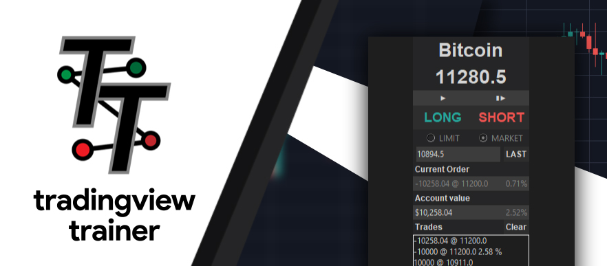

# Tradingview-trainer

tv-trainer is a lightweight application written in **python** using **selenium** and **Tkinter**, designed to work with tradingview.com to help users practice their trading on **historical data**.

# Installation
tv-trainer comes in two forms, the executable version and the python version.

[**Python Version**](https://github.com/Robswc/tradingview-trainer/wiki/Python-Installation)

[**Executable Version**](https://github.com/Robswc/tradingview-trainer/wiki/Executable-Installation)

# How to Use

## Getting Started
To launch the executable version, double click the `app.exe` after extracting the .zip.  To launch the python version, run in a command line, in the `app.py` directory; `python app.py`.  After the app luanches, a browswer window to tradingview.com's sign-in page will open.  **As of May 2019**, you will need to have an account to access the replay function (accounts are free to create!).  Sign in with your credentials and then navigate to your chart.

Once you have configured your chart to your liking, you are ready to start! Click the `bar replay` button in the top nav bar of the chart.  Move the vertical red line to the time you wish to start practicing on the historical data and click.  Next, move to the tv-trainer window.  Click the `▮▶` next bar button.  This will advance the chart 1 bar and get the information to the tv-trainer app.  **Keep in mind**, the values you see in the tv-trainer app represent the close of the previous bar, values are only updated during user actions.  You are now ready to place your orders!

## Orders

There are two types of orders available with tv-trainer.  The two most basic orders intrinsic to most exchanges.  The [limit order](https://www.investopedia.com/terms/l/limitorder.asp) and the [market order](https://www.investopedia.com/terms/m/marketorder.asp).

**Market Order**

To submit a simulated market order, ensure `market` is selected via radio-button near the top of the app.  When you reach a point where you feel you wish to buy, click `Buy`.  When you reach a point where you wish to sell, click `Sell`.  Your order will instantly be executed, using simulated [FIFO](https://github.com/Robswc/tradingview-trainer/wiki/FIFO).

**Limit Order**

To submit a simulated limit order, ensure `limit` is selected via radio-button near the top of the app.  Next, type in the limit price entry box the price of your limit order.  You can also click `last` to auto-fill the last close, making it easier to quickly change the price.  Once the price crosses or touches your limit order, the order will be executed at the limit price, using simulated [FIFO](https://github.com/Robswc/tradingview-trainer/wiki/FIFO).

**FIFO**

A more detailed explaination can be found [here](https://github.com/Robswc/tradingview-trainer/wiki/FIFO).  FIFO stands for "First In First Out".  This means orders are filled in the order they are submitted.  For this app, since there are only the user orders, the best part of FIFO (in my humble opinion) has been simulated.  Simply put, when you are long you are `100 APPL @ $100` for example.  When you are short, you are `-100 APPL @ $100`.  To close a short/long simply make your position = 0.  Again, a more detailed explaination can be found [here](https://github.com/Robswc/tradingview-trainer/wiki/FIFO).

### Exiting

Upon exiting, a file named `trades.csv` is created.  This contains your trades, it can be easily viewed with excel or similar.  When you exit, ensure both the chromedriver browser and tv-trainer window are closed.  If you run into any issues please report them! https://github.com/Robswc/tradingview-trainer/issues

### Common Errors and how to fix them

You can check out the wiki page: https://github.com/Robswc/tradingview-trainer/wiki/Errors 

This will list and show you how to fix the more common errors.

### About

That's about it!  Thank you for trying my app if this helps you in anyway feel free to follow me on twitter for more tools and updates!  

